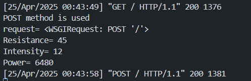
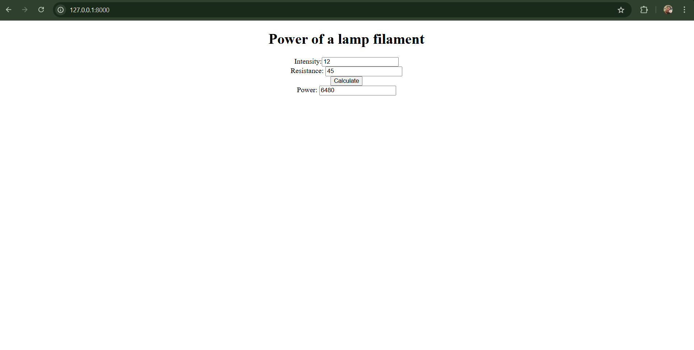

# Ex.05 Design a Website for Server Side Processing
## Date:25-04-2025

## AIM:
 To design a website to calculate the power of a lamp filament in an incandescent bulb in the server side. 


## FORMULA:
P = I<sup>2</sup>R
<br> P --> Power (in watts)
<br> I --> Intensity
<br> R --> Resistance

## DESIGN STEPS:

### Step 1:
Clone the repository from GitHub.

### Step 2:
Create Django Admin project.

### Step 3:
Create a New App under the Django Admin project.

### Step 4:
Create python programs for views and urls to perform server side processing.

### Step 5:
Create a HTML file to implement form based input and output.

### Step 6:
Publish the website in the given URL.

## PROGRAM :
``` html
<!DOCTYPE html>
<html lang="en">
<head>
    <meta charset="UTF-8">
    <meta name="viewport" content="width=device-width, initial-scale=1.0">
    <title>Document</title>
</head>
    <center>
    <div class="background">
        <div class="mask"></div>
        <div class="container">
            <h1>Power of a lamp filament</h1>
            <form method="post">
                
                <div class="box">
                    Intensity:<input type="text" name="Intensity" value="{{I}}" class="intensity"></input></br>
                </div>
                <div class="box">
                    Resistance:
                    <input type="text" name="Resistance" value={{R}} class="resistance">
                    </input></br>
                </div>
                <div>
                    <div class="buttons">
                        <input type="submit" value="Calculate" class="cal">
                        </input>
                        </br>
                    </div>
                </div>
                <div class="box">
                    Power:
                    <input type="text" name="Power" value="{{power}}" class="power">
                </input></br>
            </div>
        </form>
    </div>
  </div>
</center>
</body>
</html>
```
### urls.py

``` html
from django.contrib import admin 
from django.urls import path 
from myapp import views 
urlpatterns = [ 
    path('admin/', admin.site.urls), 
    path('power/',views.power,name="calculatepower"),
    path('',views.power,name="calculatepower")]
```
### views.py

``` html
from django.shortcuts import render

# Create your views here.
from django.shortcuts import render 
def power(request): 
    context={} 
    context['power'] = "0" 
    context['R'] = "0" 
    context['I'] = "0" 
    if request.method == 'POST': 
        print("POST method is used")
        R = request.POST.get('Resistance','0')
        I = request.POST.get('Intensity','0')
        print('request=',request) 
        print('Resistance=',R) 
        print('Intensity=',I) 
        power = int(R) * int(I) * int(I)
        context['power'] = power
        context['R'] = R
        context['I'] = I
        print('Power=',power) 
    return render(request,'myapp/math.html',context)
```
## SERVER SIDE PROCESSING:


## HOMEPAGE:


## RESULT:
The program for performing server side processing is completed successfully.
